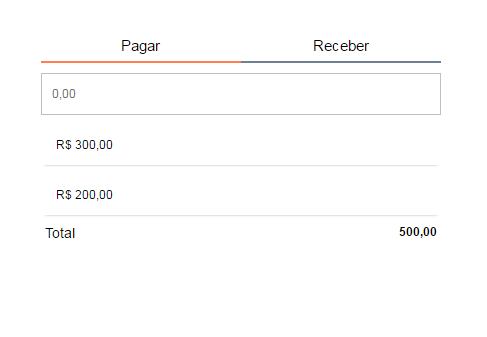

Title: Desenvolvendo uma aplicação com Vue.js
Date: 2017-05-01 19:00
Tags: javascript, Html, framework
Category: VueJs
Slug: desenvolvendo-aplicacao-com-vue
Author: Maurício Camargo Sipmann
Email: sipmann@gmail.com
Status: draft

[Vue.js](http://vuejs.org) veio como uma alternativa para outros frameworks como  Angular e React. É leve e facil de entender o seu funcionamento. Aqui vamos desenvolver uma aplicação simples de lançamento de pagamentos e receitas. Abaixo uma imagem do resultado final que queremos obter.



A idéia é termos duas abas, uma para lançar os valores recebidos e outra para os valores pagos. Para lançar um novo valor vamos usar o evento de blur do campo. E ao final da listagem um somatório dos valores. Nessa parte não vou criar nenhum componente, nem nada muito complexo. Vai ser o mais básico o possível. O css você pode pegar [aqui](http://embed.plnkr.co/r5xCzF7bpf1QNSIYrXHO/) (no exemplo mesmo).

Vamos começar com o HTML abaixo onde temos algumas coisas a serem explicadas logo de início. Logo de início temos uma div com o id `app`, este id é o que fara a ligação com o Vue (veremos mais a frente). E mais abaixo temos o `li` que fará a exibição dos itens lançados. 

```HTML
<html>

<head>
    <title>Finanças</title>
    <script src="https://cdnjs.cloudflare.com/ajax/libs/vue/2.2.6/vue.js"></script>
    <link rel="stylesheet" href="css/main.css">
    <meta charset="UTF-8">
</head>

<body>
    
    <div id="app">
        <nav>
            <a class="ativa">Pagar</a>
            <a>Receber</a>
        </nav>

        <input type="text" placeholder="0,00">

        <ul>
            <li v-for="item in itens">
                {{item}}
            </li>
        </ul>
        
        <footer>
            Total
            <span class="total">500,00</span>
        </footer>
    </div>
    <script src="js/app.js"></script>
</body>
</html>
```

Para fazer a listagem dos itens, usamos a diretiva `v-for` que recebe como parâmetro um nome de variável que receberá os itens de um objeto. No exemplo, estamos atribuindo cada item da nossa variável itens à uma variável de mesmo nome. 

Para exibir um valor de algum objeto, usamos duas chaves ao redor do nome do objeto a ser exibido.
Para termos um exemplo já funcionando vamos usar um código bem simples. Abaixo temos a declaração e inicialização do Vue, onde passamos o id do elemento que será a base da aplicação (aí que entra o id `app` da div). 

Para podermos testar a diretiva for do Vue, adicionas um array de nome `itens` com alguns dados iniciais. Preste atenção que estes itens ficam dentro da propriedade `data` do Vue, é nela que armazenaremos os dados base da aplicação. 

```javascript

new Vue({
  el: '#app',

  data: {
    itens: [
      12.50,
      22.33
    ]
  }
});
```

Adicionando Itens
-----------

Com isso, ao testarmos nosso código, devemos ver já a exibição dos itens fixos que definimos. Vamos agora adicionar a possibilidade de inserir mais itens na nossa listagem. Para isso, no HTML, vamos usar a diretiva `v-on:blur` no elemento input. Essa diretiva vai disparar o método cujo nome foi atribuido ao atributo, no evento de blur do campo. O método podemos ver abaixo, ele deve ficar localizado na propriedade `methods` do Vue.

Também adicionamos o atributo `v-model` no input. O valor deste atributo faz referência à propriedade de mesmo nome que fica na propriedade `data` da nossa aplicação.

```html
<input type="text" placeholder="0,00" v-on:blur="addItem" v-model="vlr">
```

```javascript

new Vue({
  el: '#app',

  data: {
    itens: [
      12.50,
      22.33
    ],
    vlr: ''
  },

  methods: {
    addItem: function() {
      if (this.vlr !== '' && this.vlr > 0) {
        let it = parseFloat(this.vlr, 10);
        this.itens.push(it);
        this.vlr = '';
      }
    }
  }
});
```

O código dele é bem simples de se entender já que não temos nada que faça referêcia ao framework. É justamente nesse ponto que esta a beleza de utilizar frameworks como este, eles nos facilitam muito o processo de interação entre o view do nosso app e o control dele. 

Por mais simples que seja, vale ressaltar alguns pontos. Primeiro que não acessamos nossas variáveis dentro do data referênciando `data` em si, acessamos diretamente tanto `itens` quanto `vlr`. E sim, já pode testar e verá que esta funcionando conforme o esperado.

Totalizador
-----------

Vamos agora trabalhar no nosso totalizador. Para começar, vamos adicionar no span do nosso footer a chamada pra variável `total`. Agora vamos pensar por um momento.. Poderíamos adicionar uma variável na propriedade data e realizar nela as operações para que se obtivesse o total. Mas essa não é bem a idéia da propriedade data, então pra suprir essa necessidade, vamos utilizar a propriedade `computed`.

```html
        <footer>
            Total
            <span class="total">{{ total }}</span>
        </footer>
```

Agora no nosso código, vemos que colocamos na propriedade computed, uma função de mesmo nome do que escrevemos no nosso .total. Nele um simples método reduce retornando o somatório, simples não?

```javascript
  [...]
  computed: {
    total: function () {
      return this.itens.reduce((a, b) => a + b, 0);
    }
  },
  [...]
```

Com isso temos toda a funcionalidade básica de uma das abas. Então vamos duplicar tudo e trocar os nomes para fazer a outra aba.... não. Temos algumas opções nessa parte, uma delas é componentizar o que temos até agora, e reaproveitar completamente o código e o html. Outra forma é simplesmente adicionar mais uma variável de controle e implementar um tipo em cada registro da nossa variável itens.

Abas
-----------

Desta vez vamos na segunda alternativa, uma vez que a mesma é mais simples de entendermos no momento. Vamos começar adicionar a variável pg junto dos itens e do vlr, e inicializa-la com 'pg'. Vamos utilizar dois valores, pg e rc para pagar e receber respectivamente.

Para atualizar essa variável, vamos adicionar eventos de click nos nossos `a`. Utilizaremos a diretiva `v-on:click` e no seu valor codificaremos diretamente a troca do valor (como pode ser visto abaixo).

```html
            <a v-on:click="aba = 'pg'" v-bind:class="abaAtiva('pg')">Pagar</a>
            <a v-on:click="aba = 'rc'" v-bind:class="abaAtiva('rc')">Receber</a>
```

Vemos também que atribuímos mais a diretiva `v-bind:class`, com ela podemos relacionador o valor de um atributo do elemento html com uma variável, método ou campo calculado. No caso relacionamos à um método que irá nos dizer se a aba esta ativa ou não, para assim adicionarmos uma classe css.

```javascript
    abaAtiva: function (aba) {
      return this.aba === aba ? 'ativa' : '';
    }
```

O código da aba também é muito simples. Mas ainda falta acertarmos a adição de itens na listagem e o totalizador da nossa aplicação. Para diferenciarmos os itens entre pg e rc, vamos transformar o nosso array de numéricos em um array de objetos. Vamos compor cada item de um vlr e uma aba, ficando algo como: `{ vlr: 1.1, aba: 'pg' }`. Então vamos começar alterando nosso html que irá listar tanto os itens quanto o totalizador para que ambos passem a acessar a propriedade vlr de cada item.

```html
            <li v-for="item in itensAba">
              {{item.vlr}}
            </li>

            [...]

            <span class="total">{{ total.vlr }}</span>
```

E por fim, em nosso código vamos precisar alterar nosso método total para acessar a propriedade vlr também. Mas e como faremos para listar só os itens de uma determinada aba? Se repararem bem na implementação da listagem que temos acima, vão reparar que trocamos o v-for para acessar um valor calculado (ou computado) itensAba. É nele que faremos retornar o itens de acordo com um filter pela propriedade aba. 

Novamente sem muito segredo nos códigos, já que se trata da javascript puro... Por último alteramos o nosso método `addItem` para adicionar o item na listagem que esta ativa no momento.

```javascript
    itens: [
      { vlr: 12.50, aba: 'pg' },
    [...]

    computed: {
      total: function () {
        //Retorna os itens filtrados já
        return this.itensAba.reduce(function(a, b) { return{vlr: a.vlr + b.vlr}; }, { vlr: 0 });
      },
      itensAba: function () {
        return this.itens.filter((a) => a.aba === this.aba);
      }
    }
    [...]

    addItem: function () {
      if (this.vlr !== '' && this.vlr > 0) {
        let it = parseFloat(this.vlr, 10);
        this.itens.push({ vlr: it, aba: this.aba });
        this.vlr = '';
      }
    },
```

O resultado final você pode experimentar [aqui](http://embed.plnkr.co/r5xCzF7bpf1QNSIYrXHO/). Em outro momento vamos tentar otimizar o código atravéz da criação de componentes.
