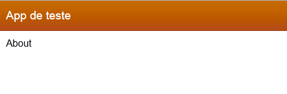
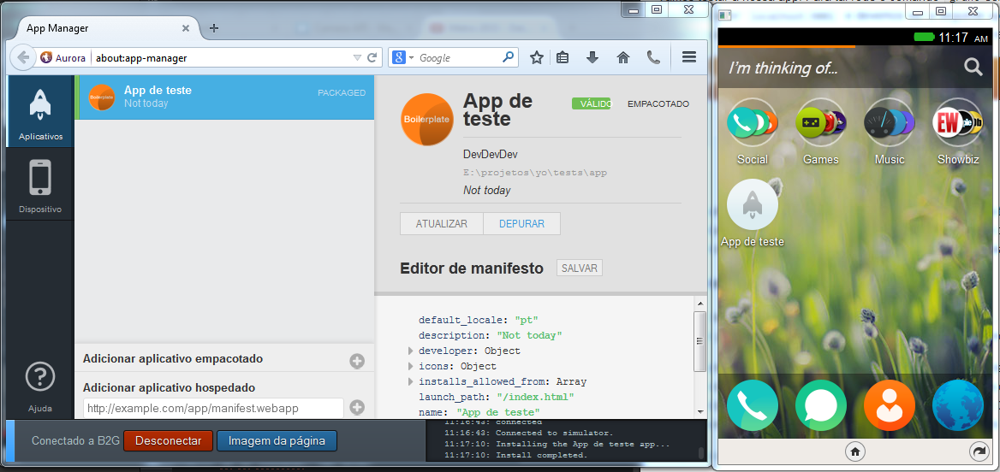

Title: Desenvolvendo apps para o FirefoxOS (Parte 1)
Date: 2014-09-02 19:00
Tags: FirefoxOS, Html, Yeoman
Category: FirefoxOS
Slug: desenvolvendo-app-firefoxos
Author: Maurício Camargo Sipmann
Email: sipmann@gmail.com
Lang: pt

### Requisitos mínimos?

Para seguir este tutorial você precisará do [Nodejs](http://nodejs.org/). Utilizaremos ele para automatizar algumas tarefas, como a criação do nosso projeto e até mesmo o empacotamento da app. Estas automatizações se darão pela utilização de algumas aplicações como o [Yeoman](http://yeoman.io/) e o [Grunt](http://gruntjs.com/) .

Também será necessário o emulador do [FirefoxOS](https://www.mozilla.org/pt-BR/firefox/os/), ele roda através do seu navegador Firefox. Para instalá-lo basta ir no menu `Ferramentas > Desenvolvedor web > App Manager`, nesta tela basta tentar iniciar o emulador, se não possuir um já instalado, você será solicitado a fazê-lo. Neste tutorial irei utilizar a versão 1.4.

### Preparando o ambiente

Tendo o Node instalado, vamos instalar o yeoman e o gerador de app para Firefox OS. Atenção para o parâmetro '-g' no processo de instalação, com ele os seus pacotes serão instalados globalmente, e não só para a pasta em que esta o prompt.

    npm install -g yo
    npm install -g generator-firefoxos-app

Com ambos os pacotes acima instalados, vamos dar início a criação da app. No seu diretório de projetos ou onde desejar criar a app chama o generator instalado.

    yo firefoxos-app

Uma vez chamado esse generator, o mesmo irá fazer alguns questionamentos, o primeiro é claro será o nome da sua aplicação, seguido da descrição e o nome do desenvolvedor.

Após a execução do generator, você já terá uma estrutura para desenvolvimento pronta, inclusive com um html inicial, com todas as dependências já instaladas. Vale ressaltar agora algumas tarefas disponíveis no Gruntfile.

* Default: Irá gerar o pacote de distribuição
* Test: Até a presente versão do generator (0.1.3) este processo irá simplesmente rodar o validador jsHint
* Server: Irá disponibilizar na porta 9001 um simples servidor para testar a sua app

Vamos testar a nossa app. Para tal, rode o comando `grunt server` e acesse no seu navegador `localhost:9001` e devemos ver a seguinte app. Caso nenhuma página seja exibida, revise os passos ateriores e verifique se nenhum erro ocorreu.

Vale ressaltar que a sua app toda estará dentro de uma pasta também chamada `app`. Nela você encontrará os seus arquivos .html, .js, .css e demais. Antes de começarmos a codificar a nossa app, vamos ver como se instala a mesma.

### Instalando a app

Para fins de teste, não é necessário rodar o comando `grunt`, sendo que ele irá testar o JS e compactar tudo em um arquivo .zip, basta apontar a instalação para a pasta `app` dentro do seu projeto. "Mas como eu faço isto?".

Indo novamente na `App Manager`, clicando na lateral esquerda, onde indica "Aplicativos", teremos então disponível no inferior da tela duas opções, vamos nos ater a utilizar a primeira (`Adicionar aplicativo hospedado`).

Clicando nesta opção vamos navegar até a pasta da app e clicar selecionada. Pronto.

Simples de se instalar, não acha? O Resultado final deve ser semelhante ao abaixo.

### Acessando uma API

Quando vamos programar algo mais complexo, geralmente vamos utilizar algo como, câmera, rede, lista de contatos, armazenamento e outras possibilidades. Para utilizarmos essas APIs, precisamos - assim como no desenvolvimento para android - especificar para o usuário no momento de instalação. Estes dados de acesso ficam no arquivo `manifes.webapp`, se você ainda não deu uma olhada neste arquivo, é nele que fica armazenado dados da app, como nome, descrição, versão, localização de ícones e é claro as permissões que a mesma requer.

As permissões ficam na propriedade permissions, na forma de `"chave" : True`. Algumas das apis são:

* câmera
* contacts
* desktop-notification
* storage

Cada permissão vai mudar o tipo de app que você esta desenvolvendo, mas aí eu sugiro ler mais na MDN [aqui](https://developer.mozilla.org/en-US/Apps/Build/App_permissions). Esse é o básico para iniciar no desenvolvimento de app para FirefoxOS. Na parte dois, vou começar a passar um pouco de código.
