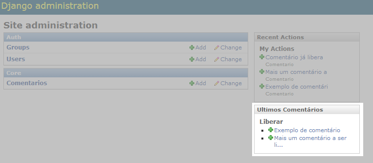

Editando o Admin do Django
##############################

:date: 2014-05-15 18:00
:tags: python, django, django-admin
:category: Python
:slug: editando-o-admin-do-django
:author: Maurício Camargo Sipmann
:email:  sipmann@gmail.com
:linkedin: sipmann
:related_posts: menu-dinamico-com-apps-do-django

Este artigo foi re-postado no grupo `PythonClub <http://pythonclub.com.br/editando-o-admin-do-django.html>`_. Vamos falar um pouco sobre como customizar o admin do Django. Primeiramente porque? A resposta é bem simples, quero mostrar algo para o usuário sem que ele precise entrar nas apps e fazer alguma consulta para então tomar alguma ação. Alguns exêmplos para isto seriam:

    - Exibir as vendas do mês em forma de gráfico por região do país
    - Exibir os últimos comentários adicionados
    - Exibir log dos ultimos usuários cadastrados

O que faremos aqui será exibir os últimos comentários ainda não liberados de um sistema de blog. Vale lembrar que aqui não discutiremos sobre os primeiros passos da aplicação. Para seguirmos adiante, vamos assumir que já temos um projeto básico com uma estrutura simples, abaixo a estrutura inicial do nosso projeto.

.. code-block:: bash

	../blog/
	├── core
	│   ├── __init__.py
	│   ├── admin.py
	│   ├── models.py
	│   ├── tests.py
	│   └── views.py
	├── blog
	│   ├── __init__.py
	│   ├── settings.py
	│   ├── urls.py
	│   └── wsgi.py
	└── manage.py

Para iniciarmos, precisamos da nossa tabela de comentários, vamos usar a mais simples e básica o possível.

+-------------+-------------+
|    Campo    |    Tipo     |
+=============+=============+
|  nome       | Varchar(30) |
+-------------+-------------+
|  texto      |    Text     |
+-------------+-------------+
|  liberado   |   Boolean   |
+-------------+-------------+
|    data     |    Date     |
+-------------+-------------+

Vamos seguir adiante e alterar a página inicial do admin para listar os últimos comentários de um simples sistema de blog. Para comerçar a editar o admin, precisamos inicialmente copiar o template que desejamos para a pasta uma pasta `admin` dentro ta pasta de templates do nosso projeto. Isto porque o Admin, não passa de uma app como outra qualquer, portanto o sistema de herança vai funcionar aqui, carregamento prioritariamente o seu template. Você pode conseguir o template que desejar (no nosso caso o index.html) dentro do projeto do Django mesmo, no meu caso "C:\\Django-1.6.3\\django\\contrib\\admin\\templates\\admin".

.. code-block:: bash

	../blog/
    	├── templates
    	│   ├── admin
    	│   │   └── index.html
    	├── core

Tire um tempo e brinque um pouco com este template e veja o que acontece se você alterar algumas coisa. Para adicionarmos a nossa listagem, vamos adicionar um painel lateral, para tal vamos adicionar o código abaixo antes do fechamento da ultima tag div. Nele podemos ver uma chamada para uma template_tag, portanto precisamos carrega-la no topo do template.

.. code-block:: html

    
    ...
    ...
    ...
    

        <h2>Ultimos Comentários</h2>
        <h3>Liberar</h3>
		
    

Esta template trata-se da responsável por fazer a consulta na base de dados e renderizar a nossa lista, portanto ela é uma 'inclusion tag'. Se você não esta familiarizado com 'template tags', talvez queira dar uma olhada na `documentação do django <https://docs.djangoproject.com/en/dev/howto/custom-template-tags/>`_.

Vamos então criar nossa template tag 'comentarios_n_liberados'. Primeiro devemos criar uma pasta chamada templatetags, dentro da nossa app core. Dentro ta pasta vamos inicializar um pacote python e criar o arquivo comentarios_tag.py. Nele precisamos declarar nosso metodo que deve se chamar 'comentarios_n_liberados' e nele fazer uma simples consulta ao banco buscando os comentários não liberados e por fim registrar a tag apontando para o template que será renderizado. Abaixo o código mais explicado.

.. raw:: html

	

		
Recomendações

		
		
	

.. code-block:: python

    from django import template
    from core import models

    #Carrega o registro de template tags
    register = template.Library()

    #Registra o metodo a seguir como uma inclusion_tag indicando o template a ser renderizad
    @register.inclusion_tag('comentarios_n_liberados.html')
    def comentarios_n_liberados():
    	comentarios = models.comentario.objects.filter(liberado=False).order_by('data')[0:5]
    	return { 'comentarios' : comentarios }

Abaixo o html do nosso template a ser renderizado, este deve estar dentro da pasta templates da nossa app core.

.. code-block:: html

    
    	
Nenhum comentário novo

    
    	<ul>
    		
    		<li class="addlink">
    			<a href="{{ c.id }}">{{ c.texto|truncatechars:30 }}</a>
    		</li>
    		
    	</ul>
    
    
    
Com tudo isto feito, basta subir o seu servidor e ver o resultado final, que pode ser visto na imagem abaixo.

Lembrando que aqui apenas mostrei como modificar o index do admin, para apenas listar dados do banco, mas você pode ir muito mais além. Abaixo fica a estrutura de diretórios final e um link para download do projeto funcionando.

.. code-block:: bash

	../blog/
	├── core
	│   ├── templates
    	│   │   └── comentarios_n_liberados.html
    	│   ├── templatetag
    	│   │   └── comentarios_tag.py
	│   ├── __init__.py
	│   ├── admin.py
	│   ├── models.py
	│   ├── tests.py
	│   └── views.py
	├── blog
	│   ├── __init__.py
	│   ├── settings.py
	│   ├── urls.py
	│   └── wsgi.py
	├── templates
    	│   ├── admin
    	│   │   └── index.html
	└── manage.py

Espero que tenham gostado, criticas/sugestões são bem-vindas. `Fontes do Projeto <https://github.com/sipmann/editando-django-admin>`_
