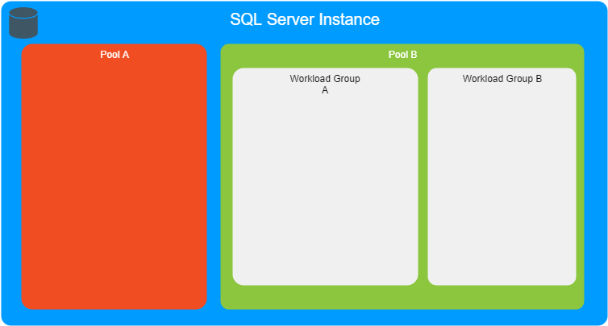

Title: Limiting Connection Resources on SQL Server 
Date: 2019-08-12 12:00
Tags: SQLServer, Resource Governor
Category: SQL Server
Slug: limiting-connection-resources-sql-server
Author: Maurício Camargo Sipmann
Email: sipmann@gmail.com
Image: /images/sql-pool.png

Have you ever suffered from a slow SQLServer database? Someone love to run that heavy query in the database? Resource Governor to the rescue. You can set a few rules on how users (connections actually) will use the server/database resources based on a few things.

First things first, if you don't have DAC enabled, enable it now. Dealing with resource governor can lock you out of the database and leave you without action (almost... you can start the server with -c -m -f).

Now to understand how Resource Governor works, we have a few keywords `resource pool`, `workload group` e  `Classifier Function`.



## Resource Pool

First, we have the Resource Pool, with is the bigger resource group that we have the ability to manage. With it, we can set a few things like: `MIN_CPU_PERCENT `, `MAX_CPU_PERCENT`, `MIN_MEMORY_PERCENT`, `MAX_MEMORY_PERCENT`, `MIN_IOPS_PER_VOLUME`, and `MAX_IOPS_PER_VOLUME`.

Be aware that the `MAX_CPU_PERCENT` will just "works" when there is another connection with a higher priority, otherwise it will use what is available.  Let's create a pool.

```mssql
CREATE RESOURCE POOL [SpreadSheet]
WITH (
    MIN_CPU_PERCENT=0,
    MAX_CPU_PERCENT=20,
    MIN_MEMORY_PERCENT=0,
    MAX_MEMORY_PERCENT=20
);
```

 ## Workload Group

Then we have a workload group that "works" inside a pool, so you can have another granularity on how you can split your resources. Again, we have a few options: `IMPORTANCE`, `REQUEST_MAX_CPU_TIME_SEC`, `REQUEST_MAX_MEMORY_GRANT_PERCENT`, `GROUP_MAX_REQUESTS`.

The `IMPORTANCE` set guesses what... the importance of that workload inside the pool, you can set LOW, MEDIUM, HIGH. GROUP_MAX_REQUESTS sets how many requests can run at the same time inside that workload (0 will set as NO LIMIT)

```mssql
CREATE WORKLOAD GROUP [DepartmentA] 
WITH (
    GROUP_MAX_REQUESTS=2,
    IMPORTANCE=LOW,
    REQUEST_MAX_CPU_TIME_SEC=10, -- Time running/using CPU
    REQUEST_MAX_MEMORY_GRANT_PERCENT=15
) USING [SpreadSheet]; -- pool name here
```

## Classifier Function 

This is where everything begins... This is the entry point where you should set the group name. It's a function that will run for every new connection so be aware that if your function runs lots of queries or some heavy stuff... that time will be added to the connection handshake. If the function returns  NULL or a group name that doesn't exist, the 'default' group will be used... Yes, there is a default workload group where everything runs where there's no classifier.

```mssql
CREATE FUNCTION fnClassWorkloadGovernor() 
RETURNS SYSNAME WITH SCHEMABINDING 
AS 
BEGIN 
    IF APP_NAME() LIKE '%Excel%'
        RETURN 'DepartmentA'
    
    IF HOST_NAME() LIKE '%THAT_MACHINE_OR_APP_SERVER%'
    	RETURN 'LowPriority'
    
    RETURN NULL
END
GO

ALTER RESOURCE GOVERNOR WITH (CLASSIFIER_FUNCTION=dbo.fnClassWorkloadGovernor);
ALTER RESOURCE GOVERNOR RECONFIGURE;
```

There you go... now you have a fully working resource governor, but look out that If you want to delete that classifier function, first you have to remove it from the resource governor (look the SCHEMABINDING at the create up there).

To disable Resource Governor

```mssql
ALTER RESOURCE GOVERNOR WITH (CLASSIFIER_FUNCTION=null)
ALTER RESOURCE GOVERNOR RECONFIGURE

ALTER RESOURCE GOVERNOR DISABLE
GO
```
