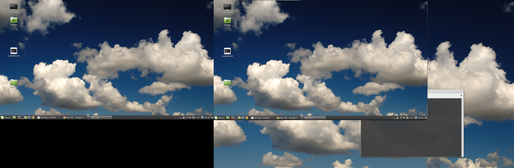

Change display settings on linux with Disper
###############################################

:date: 2018-02-27 12:40
:tags: Linux, external display, disper
:category: Linux
:slug: linux-external-display-with-disper
:author: Maurício Camargo Sipmann
:email:  sipmann@gmail.com
:linkedin: sipmann
:image: images/bug.png

From time to time, I change the Linux distro on my laptop or just do a fresh install on it. And once in a while, have random problems with external displays. It can be something really "simple" like don't detecting the external monitor or something crazy like the image below. 

As you can see at the image, the mint detected the display but mirrored it in a crazy way that works but doesn't at the same time. If you try anything and doesn't get working, or just wanna skip the whole job of configuring complexes text files, give a try to Disper_. Download the latest version.
Extract it on any folder, and make install it (on the extracted folder).

.. code-block:: shell
  
  make install

After that, you can start using it... There are a few options that will serve you well.

.. code-block:: shell

  disper -e #extend your display
  
.. code-block:: shell

  disper -c #clone your display

.. code-block:: shell

  displer -s #only your external display

.. _Disper: http://willem.engen.nl/projects/disper/