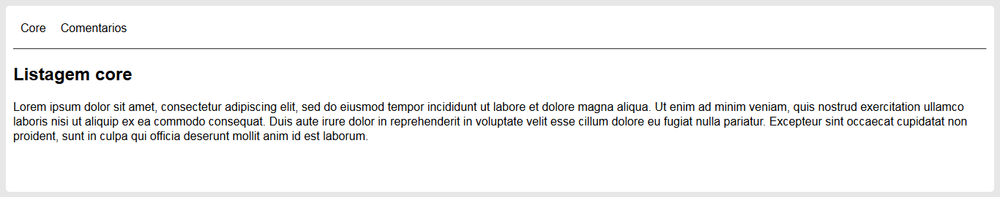

Menu dinâmico com as apps do django
####################################

:date: 2018-01-17 18:00
:tags: python, django
:category: Python
:slug: menu-dinamico-com-apps-do-django
:author: Maurício Camargo Sipmann
:email:  sipmann@gmail.com
:linkedin: sipmann
:status: draft

http://amzn.to/2D53BoH
http://amzn.to/2r8wAq6

Digamos que sua empresa trabalha com Django, desenvolvendo aplicações cujas apps são plugaveis e reutilizáveis. Por que não, se aproveitar de um certo padrão de desenvolvimento para desenvolver menus que se modificam de acordo com as apps que estão no projeto? Como o objetivo aqui, não é desenvolver uma app em si, vamos utilizar um projeto com algumas de modelo. Se desejar estudar mais sobre desenvolvimento django, a documentação é muito boa mas também temos blogs e sites excelentes sobre o assunto.

Para conseguirmos atingir esse objetivo, vamos utilizar a api `django.apps <https://docs.djangoproject.com/en/2.0/ref/settings/#installed-apps>`_ que esta disponível a partir da versão 1.7.
Com esta api, vamos percorrer as apps e se possível, criar um link para uma URL base de cada uma delas. Para começo, baixe os fontes do `projeto aqui <https://github.com/sipmann/menusapp-django/releases/tag/v1>`_, rode o pip install do projeto e no fim, sua estrutura de pastas deve ficar como abaixo.

.. code-block:: bash

	../menusapp/
	├── comentarios
	│   ├── templates
	│   │   └── comentarios
	│   │      └── listagem.html
	│   ├── __init__.py
	│   ├── admin.py
	│   ├── apps.py
	│   ├── models.py
	│   ├── tests.py
	│   ├── urls.py
	│   └── views.py
	├── core
	│   ├── templates
	│   │   └── core
	│   │       └── base.html
	│   │       └── listagem.html
	│   ├── __init__.py
	│   ├── admin.py
	│   ├── apps.py
	│   ├── models.py
	│   ├── tests.py
	│   ├── urls.py
	│   └── views.py
	├── menusapp
	│   ├── __init__.py
	│   ├── settings.py
	│   ├── urls.py
	│   └── wsgi.py
	└── manage.py

Rode o projeto e veja como é o seu funcionamento. É na app core que temos a base do nosso HTML, então será nele que iremos trabalhar. Quando se trata de algo que será renderizado no template base, eu gosto muito de utilizar 'template tags' para facilitar. 
Neste `link <http://www.sipmann.com/editando-o-admin-do-django.html>`_ tem mais um exêmplo de utilização de 'template tag' caso esteja interessado.

Vamos então criar uma pasta chamada template_tag e dentro dela o nossa tag. Vamos chamala de menus_tag.py. Abaixo vamos ver um pouco da nossa tag.
O código é bem simples e auto explicativo, importamos as bibliotecas necessárias e realizaos o @register da tag com o nome do template que será renderizado.
E por ultimo, retornamos uma tupla de dados para o template.

.. code-block:: python

    from django import template
    from django.apps import apps

    #Carrega o registro de template tags
    register = template.Library()

    #Registra o metodo a seguir como uma inclusion_tag indicando o template a ser renderizado
    @register.inclusion_tag('menus_por_app.html')
    def menus_por_app():
    	lst = apps.get_app_configs()
    	return { 'lst_apps' : lst }

O template esta abaixo e é simplesmente um for percorrendo as apps e gerando uma lista com os seus menus. As outras propriedades você pode ver direto na `documentação <https://docs.djangoproject.com/en/2.0/ref/applications/#django.apps.AppConfig>`_.
Algumas ressalvas para o que foi feito, por questões de praticidade para uso posterior, utilizei um with para concatenar e gerar a url e criei um apelido para a url para validar a existencia da mesma. Fora isto, nada de novo.

.. code-block:: html

    
        
Nenhuma app

    
        <ul>
            
                
                    
                    
                    <li>
                        <a href="">{{ app.verbose_name|truncatechars:30 }}</a>
                    </li>
                    
                
            
        </ul>
    

Feito todo estas tags, agora só precisamos realizar a chamada da tag no template `base.html`. Isso é bem simples, colocamos na primeira linha `` para então, onde desejamos que seja renderizado o menu, realizamos a chamada para a tag em si com ``. Estes caras, nós colocamos no nosso template `base.html` e assim vamos obter o resultado final.

No final, o resultado obtido deve ser semelhante ao acima. Repare que esta listando as duas aplicações, `core` e `comentarios`. E acima de tudo, repare que só serão exibidos os links cuja app tenha um namespace de mesmo nome e uma url de nome `listagem`, este é um dos meios de se limiar quais apps você quer que liste.
A estrutura final pode ser visto abaixo. Atente-se aos nomes tanto das pastas quanto dos arquivos, pois qualquer diferença pode causar o não funcionamento.

.. code-block:: bash

	../menusapp/
	├── comentarios
	│   ├── ...
	├── core
	│   ├── templates
	│   │   └── core
	│   │   │   └── base.html
	│   │   │   └── listagem.html
	│   │   └── menus_por_app.html
	│   ├── templatetags
	│   │   ├── __init__.py
	│   │   └── menus_tag.py
	│   ├── __init__.py
	│   ├── admin.py
	│   ├── apps.py
	│   ├── models.py
	│   ├── tests.py
	│   ├── urls.py
	│   └── views.py
	├── menusapp
	│   ├── ...
	└── manage.py

Espero que tenham gostado, criticas/sugestões são bem-vindas. `Fontes do Projeto <https://github.com/sipmann/menusapp-django/releases/tag/v2>`_
