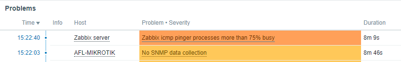

Title: Zabbix ICMP pinger processes more than 75%
Date: 2020-05-25 16:00
Tags: Zabbix, icmp pinger, icmp pinger more than 75, Zabbix Server
Category: Linux
Slug: zabbix-icmp-pinger-processes-more-than-75
Author: Maurício Camargo Sipmann
Email: sipmann@gmail.com

So your monitoring sytems have grown and your zabbix started loggin "Zabbix icmp pinger processes more than 75% busy" at the dashboard like the following image.



All you have to do is open your config file (`/etc/zabbix/zabbix_server.conf`) and find the a tag named `StartPingers`. It'll be commented by default. Uncomment it and set it's value to something like 3 or 4. It should solve your problem.

```shell

### Option: StartPingers
#       Number of pre-forked instances of ICMP pingers.
#
# Mandatory: no
# Range: 0-1000
# Default:
StartPingers=4
```

