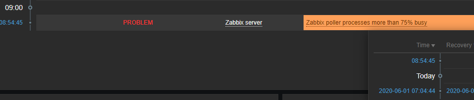
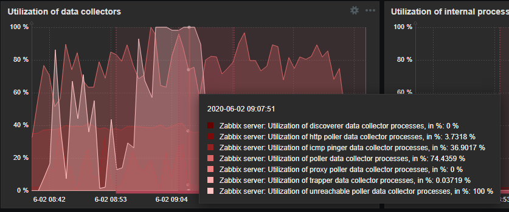
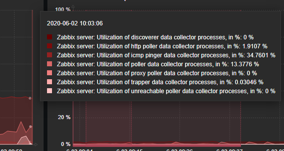

Title: Zabbix poller processes more than 75%
Date: 2020-07-02 19:00
Tags: Zabbix, Shell, Zabbix Poller, Poller proccess
Category: Linux
Slug: zabbix-poller-processes-more-than-75
Author: Maurício Camargo Sipmann
Email: sipmann@gmail.com
Lang: pt
Description: Processo de poller do Zabbix com mais de 75%
Status: Draft

Este é o terceiro post sobre configurações para o Zabbix. Todas as alterações que eu sugiro nestes posts, são baseadas em um servidor com 50+ hosts. Outro problema que pode ocorrer em seu servidor, é o poller de informações ficar sobrecarregado pela quantidade de servidores que ele precisa pegar carga de informações juntamente com os servidores que não respondem a requisição. Abaixo duas imagens onde você pode ver o log e um gráfico onde aparecem os percentuais de uso dos poller. 





To solve, let's go back to the `zabbix_server.conf` file and find two variables, `StartPollers` and `StartPollersUnreachable`. Increase them as needed. There's no magic number, you must see what works for you. But keep in mind that the `StartPollersUnreachable` is responsible for that host that can't be "reached"  (of course) and will hold your poller more time.

```ini
### Option: StartPollers
#       Number of pre-forked instances of pollers.
#
# Mandatory: no
# Range: 0-1000
# Default:
StartPollers=20

#...

### Option: StartPollersUnreachable
#       Number of pre-forked instances of pollers for unreachable hosts (including IPMI and Java).
#       At least one poller for unreachable hosts must be running if regular, IPMI or Java pollers
#       are started.
#
# Mandatory: no
# Range: 0-1000
# Default:
StartPollersUnreachable=5
```

Depois da alteração, reinicie o serviço e espere alguns momentos e veja o seu dashboard novamente. Abaixo o efeito que a troca teve em um dos servidores que acompanho.



